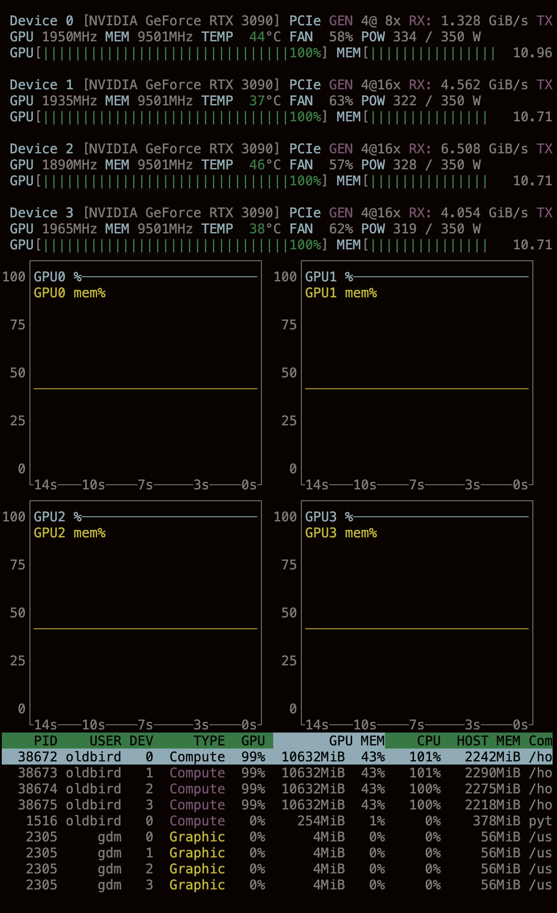

# Wan-Gradio-MultiGPU
WAN 2.1 多GPU并行视频生成界面


# WAN 2.1 多GPU并行视频生成界面

## 背景

WAN 2.1是一个强大的视频生成模型，但官方仅提供了单GPU的Gradio界面。对于拥有多张GPU的用户来说，每次都需要通过命令行执行，操作繁琐且不够直观。本项目提供了一个支持多GPU并行推理的Gradio界面，让多卡用户能够更方便地使用WAN 2.1模型生成高质量视频。

## 解决的问题

1. **多GPU并行推理**：充分利用多张GPU的计算能力，加速视频生成过程
2. **用户友好界面**：无需编写复杂的命令行参数，通过图形界面轻松设置生成参数
3. **自动模型路径选择**：根据选择的任务类型自动更新模型路径
4. **提示词扩展功能**：支持使用本地Qwen模型或DashScope API扩展提示词，提升生成质量

## 使用方法

### 安装

确保安装了Wan2.1并且下载了的模型：
安装Wan2.1
```bash
git clone https://github.com/Wan-Video/Wan2.1.git
cd Wan2.1

# Ensure torch >= 2.4.0
pip install -r requirements.txt
```

### 下载模型
Download models using 🤖 modelscope-cli:

```bash
pip install modelscope
modelscope download Wan-AI/Wan2.1-T2V-1.3B --local_dir ./Wan2.1-T2V-1.3B
modelscope download Wan-AI/Wan2.1-T2V-14B --local_dir ./Wan2.1-T2V-14B
```

### 安装Wan-Gradio-MultiGPU
将t2v_gradio_parallel.py和generate_multi_gpu.py下载放在Wan2.1的根目录


### 启动界面

```bash
DASH_API_KEY=YOUR_DASH_API_KEY python t2v_gradio_parallel.py
```

启动后，访问 `http://localhost:7860` 即可打开界面。

注意：没有加DASH_API_KEY，提示词扩展功能不会生效



[运行界面.png](运行界面)

## 功能特点

1. **多GPU并行**：自动检测可用GPU数量，支持用户选择使用的GPU数量
2. **模型任务选择**：支持多种模型任务（t2v-1.3B、t2v-14B等）
3. **自动路径选择**：根据选择的任务自动更新模型路径
4. **提示词扩展**：支持使用本地Qwen模型或DashScope API扩展提示词
5. **高级设置**：支持T5 FSDP、DiT FSDP、T5 CPU等高级选项

## 已知限制

1. **模型卸载问题**：目前尚未解决模型在GPU中不卸载的问题。每次生成视频后，模型仍会从GPU内存中卸载，导致后续生成需要重新加载模型，无法达到加快后续视频生成速度的目的。
2. **仅支持文生视频**：当前版本仅支持文本到视频(T2V)的生成，不支持图像到视频(I2V)的生成。
3. **内存占用**：多GPU并行推理会占用较大的GPU内存，请确保系统有足够的资源。

## 提示词扩展方法

本界面支持两种提示词扩展方法：

1. **本地Qwen模型**：使用本地部署的Qwen模型进行提示词扩展，无需网络连接，但需要额外的GPU资源。
2. **DashScope API**：使用阿里云DashScope API进行提示词扩展，需要设置环境变量`DASH_API_KEY`。

要使用提示词扩展功能：
1. 在界面中勾选"启用提示词扩展"
2. 选择扩展方法（默认为local_qwen）
3. 在高级设置中可以修改扩展模型和目标语言

## 参数说明

- **模型任务**：选择要使用的模型任务类型
- **GPU数量**：选择用于并行推理的GPU数量
- **模型路径**：模型检查点目录路径，会根据选择的任务自动更新
- **提示词**：描述您想要生成的视频内容
- **负面提示词**：您不希望在视频中出现的内容
- **分辨率**：生成视频的分辨率
- **采样步数**：影响生成质量和速度，步数越高质量越好但速度越慢
- **引导尺度**：控制生成内容与提示词的匹配程度
- **位移尺度**：影响视频的时间动态特性
- **随机种子**：控制生成的随机性，-1表示使用随机种子

## 未来改进方向

1. 解决模型在GPU中不卸载的问题，实现真正的模型缓存
2. 添加图像到视频(I2V)的支持
3. 优化内存使用，减少GPU资源占用
4. 添加更多的提示词扩展方法和模型选项

## 贡献

欢迎提交问题报告和改进建议，一起让这个工具变得更好！
